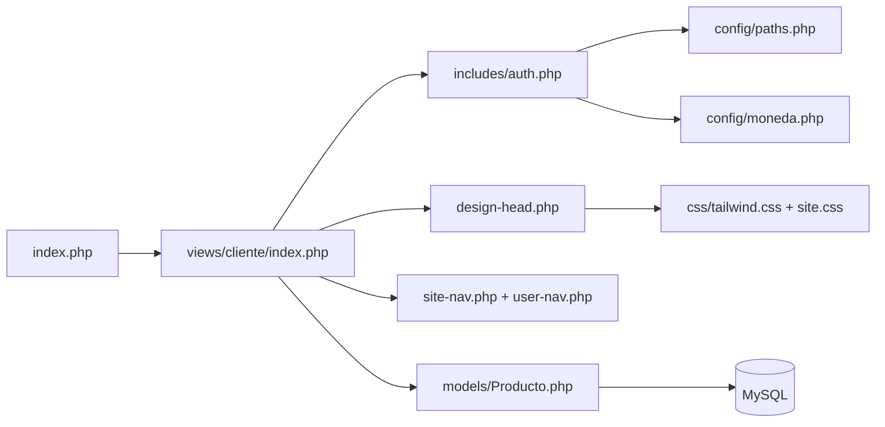
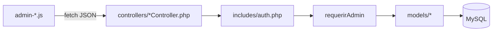
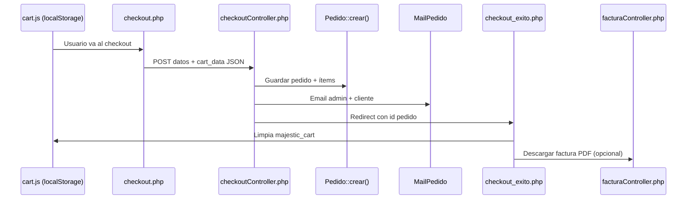

# DEPORTIVO

Tienda en línea de ropa deportiva (camisetas, pantalonetas y más). Proyecto PHP sin framework, con MySQL, panel de administración integrado y diseño **Kinetic Noir** (Tailwind compilado localmente + CSS propio).

---

## Tabla de contenidos

1. [Visión general](#visión-general)
2. [Requisitos](#requisitos)
3. [Instalación](#instalación)
4. [Primer uso (BD limpia)](#primer-uso-bd-limpia)
5. [Estructura del proyecto](#estructura-del-proyecto)
6. [Cómo se conectan las piezas](#cómo-se-conectan-las-piezas)
7. [Área cliente](#área-cliente)
8. [Área administrador](#área-administrador)
9. [Modelos y base de datos](#modelos-y-base-de-datos)
10. [Configuración](#configuración)
11. [Diseño y estilos](#diseño-y-estilos)
12. [Pedidos, correo y facturas](#pedidos-correo-y-facturas)
13. [Desarrollo](#desarrollo)
14. [Git y archivos ignorados](#git-y-archivos-ignorados)

---

## Visión general

| Capa | Tecnología |
|------|------------|
| Backend | PHP 8+ (PDO) |
| Base de datos | MySQL / MariaDB |
| Frontend | HTML, Tailwind CSS (build local), JavaScript vanilla |
| Sesiones | PHP `$_SESSION` |
| Correo | SMTP (Gmail) vía `SmtpMailer` |
| PDF | Dompdf (`composer`) para facturas |
| Assets | CSS/JS en `css/` y `js/`, imágenes en `uploads/` |

**Entrada del sitio:** `index.php` redirige a `views/cliente/index.php` (home de la tienda).

No hay router central: cada página es un archivo PHP y las APIs del admin responden JSON desde `views/administrador/controllers/`.

### Funcionalidades principales

| Módulo | Descripción |
|--------|-------------|
| Catálogo | Productos por categoría, filtros de talla/color, detalle con galería |
| Carrito y checkout | Carrito en `localStorage`, formulario de envío, código postal opcional |
| Cuentas | Registro, login, nombre completo en el header (no el correo) |
| Admin inline | Editar productos e imágenes desde el catálogo/home sin salir de la tienda |
| Pedidos | Panel admin con listado, estados y notificación por correo |
| Categorías | CRUD completo desde el panel admin |
| Usuarios | CRUD de clientes y administradores |
| Facturas | Descarga de factura PDF tras confirmar la compra |
| Correo | Notificación al admin y al cliente; aviso de “pedido en camino” |

---

## Requisitos

- PHP 8.0+ con extensiones `pdo_mysql`, `openssl`, `mbstring`
- MySQL o MariaDB
- [Composer](https://getcomposer.org/) (para Dompdf / facturas PDF)
- Node.js 18+ y npm (solo para compilar Tailwind; el CSS compilado ya viene en el repo)
- Servidor web (Laragon, Apache, Nginx, etc.)
- Cuenta Gmail con contraseña de aplicación (para notificaciones de pedidos)

---

## Instalación

### 1. Clonar e instalar dependencias

```bash
git clone <url-del-repositorio> deportivo
cd deportivo

composer install
npm install
npm run build:css
```

| Comando | Genera | Para qué sirve |
|---------|--------|----------------|
| `composer install` | `vendor/` | Facturas PDF (Dompdf) |
| `npm install` | `node_modules/` | Compilar Tailwind (solo si modificas clases) |
| `npm run build:css` | `css/tailwind.css` | Actualizar utilidades Tailwind tras cambios |

> `vendor/` y `node_modules/` están en `.gitignore`. Cada entorno debe ejecutar `composer install` y, si hace falta, `npm install`.

### 2. Base de datos

1. Crea una base de datos llamada `deportivo`.
2. En phpMyAdmin, selecciónala → pestaña **SQL** → importa o pega:

   ```
   database/deportivo_phpmyadmin.sql
   ```

3. El script deja la BD **limpia**:
   - Estructura completa de todas las tablas
   - **Un solo usuario administrador** (`admin@denim.com`, nombre “Administrador DEPORTIVO”)
   - Sin categorías, productos ni pedidos

4. Solo si migras una BD antigua y falta el estado `cancelado` en pedidos:

   ```
   database/alter_pedidos_cancelado.sql
   ```

### 3. Conexión PHP

Edita `config/database.php` con tus credenciales:

```php
$host = 'localhost';
$dbname = 'deportivo';
$user = 'root';
$password = 'tu_password';
```

### 4. Correo (pedidos)

Edita `config/mail.php` con tu Gmail y contraseña de aplicación:

```php
'smtp_user' => 'tu-correo@gmail.com',
'smtp_pass' => 'contraseña-de-aplicacion-sin-espacios',
'admin_email' => 'tu-correo@gmail.com',
```

Para Gmail: activa verificación en 2 pasos y crea una contraseña de aplicación en [Google Account](https://myaccount.google.com/apppasswords).

### 5. Servidor

Apunta el document root a la carpeta del proyecto (ej. `http://deportivo.test` en Laragon).

### 6. Acceso administrador

| Campo | Valor |
|-------|-------|
| Correo | `admin@denim.com` |
| Nombre | Administrador DEPORTIVO |

La contraseña es la definida en ese registro de la BD. Si no la conoces, actualízala desde phpMyAdmin (hash bcrypt) o crea otro admin en **Administración → Usuarios**.

---

## Primer uso (BD limpia)

Tras instalar con el SQL limpio, sigue este orden:

1. Inicia sesión como admin (`admin@denim.com`).
2. Ve a **Categorías** y crea las categorías del catálogo (ej. Camisetas, Pantalonetas).
3. Crea **productos** con “Nuevo producto” en la barra admin o editando inline en el catálogo.
4. Opcional: crea cuentas de **cliente** en **Usuarios**.
5. Prueba una compra de prueba para verificar correos y factura PDF.

---

## Estructura del proyecto

```
deportivo/
├── index.php                 # Redirige al home del cliente
├── composer.json             # Dompdf para facturas PDF
├── composer.lock             # Versiones exactas de Composer
├── package.json              # Build de Tailwind
├── package-lock.json
├── tailwind.config.js
├── postcss.config.js
├── .gitignore
│
├── config/
│   ├── database.php          # Conexión MySQL (credenciales locales)
│   ├── mail.php              # SMTP Gmail (credenciales locales)
│   ├── moneda.php            # COP, envío, formateo de precios
│   ├── paths.php             # Rutas web y helpers URL
│   └── whatsapp.php          # Legacy (no se usa en checkout)
│
├── includes/
│   ├── auth.php              # Sesión, rutas, $esAdmin, nombre en header
│   ├── MailPedido.php        # Plantillas de correo de pedidos
│   ├── SmtpMailer.php        # Cliente SMTP
│   ├── FacturaPdf.php        # Generación de factura PDF
│   ├── ImagenProducto.php    # Subida de imágenes de productos
│   └── WhatsAppPedido.php    # Legacy (no se usa en checkout)
│
├── models/
│   ├── Producto.php
│   ├── Categoria.php
│   ├── Pedido.php
│   ├── Usuario.php
│   └── SitioImagen.php
│
├── middleware/               # Middleware legacy de sesión
├── database/
│   ├── deportivo_phpmyadmin.sql
│   └── alter_pedidos_cancelado.sql
│
├── css/                      # Estilos compilados y por página
├── js/theme/                 # Tema, tokens Tailwind, modo oscuro
├── data/                     # JSON de imágenes del sitio
├── uploads/                  # Imágenes subidas (productos, sitio)
├── vendor/                   # Composer (ignorado por Git)
├── node_modules/             # npm (ignorado por Git)
│
└── views/
    ├── cliente/              # Tienda pública
    │   ├── index.php         # Home
    │   ├── views/            # Páginas (catálogo, checkout, login…)
    │   ├── includes/         # Nav, footer, cards, design-head
    │   ├── controllers/      # Login, registro, checkout, factura
    │   └── js/               # Carrito, favoritos, filtros
    └── administrador/        # Panel de gestión
        ├── views/            # pedidos, categorías, usuarios
        ├── includes/         # Barra admin, modales de producto/imagen
        ├── controllers/      # APIs JSON
        ├── js/               # Lógica admin por sección
        └── css/              # Estilos solo del admin
```

---

## Cómo se conectan las piezas

### Flujo de una petición (página cliente)



1. **`includes/auth.php`** — Inicia sesión, calcula rutas (`$assetBase`, `$clienteViewsPath`, `$adminControllersPath`…) con `deportivo_init_paths()`, expone `$esAdmin` y `$usuarioDisplayNombre`.
2. **`config/paths.php`** — Resuelve URLs relativas según desde qué carpeta se ejecuta el script (cliente, admin o raíz).
3. **Vistas** — Incluyen partials (`site-nav`, `site-footer`, `producto-card`) y, si el usuario es admin, el panel inline.

### Flujo de una API admin



Todas las APIs admin definen `DEPORTIVO_JSON_API`, cargan `auth.php`, llaman `requerirAdmin()` y devuelven `{ ok: true/false, ... }`.

### Flujo de compra



- **Carrito:** `localStorage` clave `majestic_cart` (no hay tabla de carrito en BD).
- **Pedido:** Tablas `pedidos` + `pedido_items`.
- **Notificación:** Gmail SMTP (no WhatsApp).
- **Factura:** PDF con Dompdf tras confirmar el pedido.

---

## Área cliente

### Páginas (`views/cliente/views/`)

| Archivo | Función |
|---------|---------|
| `catalogo.php` | Lista productos por categoría (`?categoria=slug`), filtros de talla/color |
| `producto.php` | Detalle, tallas, galería, añadir al carrito |
| `carrito_compras.php` | Bolsa de compras |
| `checkout.php` | Formulario de envío (código postal y notas opcionales) |
| `checkout_exito.php` | Confirmación tras comprar + enlace a factura PDF |
| `login.php` | Login y registro |
| `favoritos.php` | Lista de favoritos (`localStorage`) |
| `nosotros.php` | Página institucional |

### Controladores (`views/cliente/controllers/`)

| Archivo | Función |
|---------|---------|
| `loginController.php` | Autenticación; guarda `nombre` y `apellido` en sesión |
| `registerController.php` | Registro de clientes |
| `logout.php` | Cerrar sesión |
| `checkoutController.php` | Procesa pedido, envía correos, redirige a éxito |
| `facturaController.php` | Descarga factura PDF (requiere `composer install`) |

### JavaScript cliente (`views/cliente/js/`)

| Archivo | Función |
|---------|---------|
| `cart.js` | Carrito en `localStorage`, modal lateral, widget en nav |
| `checkout.js` | Resumen del carrito en checkout |
| `favorites.js` | Favoritos en `localStorage` |
| `catalogo-filters.js` | Filtros en catálogo sin recargar |
| `size-guide.js` | Modal guía de tallas |

### Includes importantes

| Archivo | Función |
|---------|---------|
| `design-head.php` | Carga fuentes, `tailwind.css`, `site.css` y CSS de página |
| `site-nav.php` | Navegación; oculta carrito/favoritos/búsqueda si `$esAdmin` |
| `user-nav.php` | Muestra **nombre completo** del usuario logueado (no el correo) |
| `producto-card.php` | Tarjeta reutilizable en catálogo y carrito |
| `sport-images.php` | Imágenes del sitio y helpers para modo admin inline |
| `cart-widget.php` | Icono y contador del carrito en la nav |
| `favorites-widget.php` | Icono de favoritos en la nav |

---

## Área administrador

Hay **dos modos** de administración:

### 1. Edición inline (en páginas del cliente)

Si `$esAdmin === true`, se incluye `administrador/includes/admin-panel.php`, que carga:

- **admin-bar.php** — Barra con enlaces a Categorías, Pedidos, Usuarios y “Nuevo producto”
- **admin-modal.php** — CRUD de productos
- **admin-image-modal.php** — Cambiar imágenes del sitio o galería de productos

El admin puede hacer clic en productos e imágenes en el catálogo/home para editarlos sin salir de la tienda.

### 2. Pantallas dedicadas (`views/administrador/views/`)

| Archivo | Función |
|---------|---------|
| `pedidos.php` | Listado paginado, detalle, cambio de estado, correo al marcar “enviado” |
| `categorias.php` | Crear, editar y eliminar categorías |
| `usuarios.php` | Crear, editar y eliminar usuarios (clientes y admins) |

#### Gestión de usuarios

Desde **Usuarios** puedes:

- Ver todos los registros (nombre, correo, rol, fecha de registro)
- Crear cuentas con rol **cliente** o **admin**
- Editar datos; la contraseña es opcional al editar (en blanco = no cambia)
- Eliminar usuarios

**Protecciones:**

- No puedes eliminar tu propia cuenta con la sesión activa
- No se puede eliminar al único administrador
- No puedes quitarte el rol de admin a ti mismo
- El correo debe ser único; contraseña mínima de 6 caracteres al crear o cambiar

### APIs (`views/administrador/controllers/`)

| Controlador | Acciones principales |
|-------------|----------------------|
| `productoController.php` | `get`, `create`, `update`, `delete`, `categorias`, imágenes |
| `sitioController.php` | Imágenes del home/catálogo (`data/site-images.json`) |
| `pedidoController.php` | `list`, `get`, `update_estado`, `count_pendientes` |
| `categoriaController.php` | `list`, `get`, `create`, `update`, `delete` |
| `usuarioController.php` | `list`, `get`, `create`, `update`, `delete` |

### JavaScript admin (`views/administrador/js/`)

| Archivo | Conecta con |
|---------|-------------|
| `admin.js` | `productoController.php` |
| `admin-images.js` | `productoController.php`, `sitioController.php` |
| `admin-pedidos.js` | `pedidoController.php` |
| `admin-categorias.js` | `categoriaController.php` |
| `admin-usuarios.js` | `usuarioController.php` |

### CSS admin (`views/administrador/css/`)

| Archivo | Uso |
|---------|-----|
| `admin-edit.css` | Modales y formularios compartidos |
| `admin-pedidos.css` | Tabla y detalle de pedidos |
| `admin-categorias.css` | Tabla y modal de categorías |
| `admin-usuarios.css` | Tabla y modal de usuarios |

---

## Modelos y base de datos

### Modelos (`models/`)

| Clase | Responsabilidad |
|-------|-----------------|
| `Producto.php` | Catálogo, CRUD admin, tallas, imágenes, slugs |
| `Categoria.php` | CRUD categorías, conteo de productos, slugs únicos |
| `Pedido.php` | Crear pedidos, listar, paginar, estados, enriquecer ítems con imagen |
| `Usuario.php` | CRUD usuarios, validación de email, protección del único admin |
| `SitioImagen.php` | Imágenes configurables del sitio |

### Tablas principales

| Tabla | Descripción |
|-------|-------------|
| `usuarios` | Clientes y admins (`rol`: `cliente` \| `admin`) |
| `categorias` | Categorías del catálogo (`slug` para URLs) |
| `productos` | Productos activos/inactivos, precio en COP |
| `producto_tallas` | Tallas por producto |
| `producto_imagenes` | Galería adicional |
| `pedidos` | Cabecera del pedido (cliente, envío, totales, `estado`) |
| `pedido_items` | Líneas del pedido (snapshot nombre/precio/talla) |

**Estados de pedido:** `pendiente`, `confirmado`, `enviado`, `cancelado`.

**Moneda:** pesos colombianos (COP). Envío gratis desde **$350.000**; si no, **$15.000** (`config/moneda.php`).

---

## Configuración

| Archivo | Qué configura |
|---------|----------------|
| `config/database.php` | Conexión PDO a MySQL |
| `config/paths.php` | Rutas web y helpers `deportivo_cliente_url()`, `deportivo_admin_url()` |
| `config/moneda.php` | COP, envío gratis desde $350.000, costo envío $15.000 |
| `config/mail.php` | SMTP Gmail para pedidos |
| `config/whatsapp.php` | Legacy (ya no se usa en checkout) |

### Autenticación (`includes/auth.php`)

- Inicia sesión PHP con cookie scoped al proyecto.
- Variables útiles:
  - `$usuarioLogueado` — ¿hay sesión activa?
  - `$esAdmin` — ¿rol administrador?
  - `$usuarioDisplayNombre` — nombre + apellido para el header
  - `$assetBase`, `$clienteViewsPath`, `$adminControllersPath` — rutas
- `requerirAdmin()` — Para APIs JSON; responde 403 si no es admin.

---

## Diseño y estilos

Sistema **Kinetic Noir**: documentado en `css/DESIGN.md`.

### Capas de CSS (orden de carga)

1. **`css/tailwind.css`** — Utilidades Tailwind compiladas (clases del markup).
2. **`css/site.css`** — Importa tokens, tema, componentes compartidos.
3. **`css/pages/*.css`** — Estilos específicos por página (index, catálogo, login…).
4. **`css/core/theme.css`** — Overrides de modo claro/oscuro sobre variables CSS.

### Tailwind (build local)

| Archivo | Rol |
|---------|-----|
| `js/theme/deportivo-tokens.cjs` | **Fuente única** de colores, tipografías y espaciados |
| `tailwind.config.js` | Escanea `views/`, `js/`, `css/` y aplica tokens |
| `css/tailwind-source.css` | `@tailwind base/components/utilities` |
| `css/tailwind.css` | **Salida compilada** (incluida en el repo) |

```bash
npm run build:css   # Compilar tras cambiar clases Tailwind
npm run watch:css   # Desarrollo con watch
```

### Modo oscuro

- `js/theme/init.js` — Lee `localStorage` y aplica clase `dark` en `<html>`.
- `js/theme/toggle.js` — Botón en la navegación.

---

## Pedidos, correo y facturas

### Al confirmar un pedido (`checkoutController.php`)

1. Valida formulario y carrito JSON.
2. `Pedido::crear()` — Transacción: inserta `pedidos` + `pedido_items`.
3. `MailPedido::notificarPedidoNuevo()` — Envía:
   - Correo al **admin** (`config/mail.php` → `admin_email`)
   - Correo de **confirmación al cliente**
4. Redirige a `checkout_exito.php` con el ID del pedido.

### Al cambiar estado a “enviado” (admin)

- `pedidoController.php` → `MailPedido::enviarPedidoEnCamino()` — Avisa al cliente que el pedido va en camino.

### Factura PDF

- Tras la compra, `checkout_exito.php` ofrece **Descargar factura**.
- `facturaController.php` usa Dompdf (`includes/FacturaPdf.php`).
- Requiere `composer install`; sin `vendor/` responde con error 503.
- Solo puede descargarla quien realizó el pedido (usuario logueado) o quien completó el checkout en esa sesión.

### Clases de correo

| Archivo | Función |
|---------|---------|
| `includes/SmtpMailer.php` | Cliente SMTP (Gmail, STARTTLS) |
| `includes/MailPedido.php` | Plantillas HTML/texto de pedidos |

---

## Desarrollo

### Convenciones de rutas

- Desde **cliente/views**: `catalogo.php`, `../controllers/checkoutController.php`
- Desde **administrador/views**: `pedidos.php`, APIs vía `$adminControllersPath`
- Assets globales: `$assetBase` + `css/`, `js/`, `uploads/`

### Añadir una página cliente

1. Crear `views/cliente/views/mi-pagina.php`
2. Incluir `auth.php` y `design-head.php`
3. Reutilizar `site-nav.php` y `site-footer.php`
4. Si usas clases Tailwind nuevas → `npm run build:css`

### Añadir una pantalla admin

1. Crear `views/administrador/views/mi-seccion.php` (proteger con `$esAdmin`)
2. Crear `controllers/miController.php` + JS/CSS en `administrador/`
3. Enlazar desde `admin-bar.php`

### Subida de imágenes

- `includes/ImagenProducto.php` — Valida y guarda en `uploads/productos/` o `uploads/sitio/`
- Usado por `productoController.php` y modales admin

### Datos que NO están en MySQL

| Dato | Dónde vive |
|------|------------|
| Carrito | `localStorage` → `majestic_cart` |
| Favoritos | `localStorage` |
| Imágenes del sitio (hero, banners) | `data/site-images.json` + `uploads/sitio/` |

---

## Git y archivos ignorados

El `.gitignore` actual excluye:

```
node_modules/
vendor/
```

### Qué significa y qué hacer tras clonar

| Ignorado | Por qué | Qué hacer |
|----------|---------|-----------|
| `vendor/` | Dependencias PHP generadas por Composer (Dompdf, etc.). Son pesadas y se instalan con un comando. | `composer install` |
| `node_modules/` | Dependencias npm para compilar Tailwind. | `npm install` (solo si vas a compilar CSS) |

### Qué sí está en el repositorio

| Archivo | Para qué sirve |
|---------|----------------|
| `composer.json` + `composer.lock` | Paquetes PHP; `composer install` usa el lock para las mismas versiones |
| `package.json` + `package-lock.json` | Paquetes npm para Tailwind |
| `css/tailwind.css` | CSS ya compilado; el sitio funciona sin Node en producción |
| `database/deportivo_phpmyadmin.sql` | Estructura de BD + admin inicial |

### Archivos sensibles (no ignorados, pero no subir credenciales reales)

Estos archivos **sí pueden estar en el repo** con valores de ejemplo, pero en producción debes usar credenciales propias y **no commitear contraseñas reales**:

- `config/database.php` — usuario y contraseña de MySQL
- `config/mail.php` — credenciales SMTP de Gmail

### Checklist rápido tras `git clone`

```bash
composer install
npm install                  # Opcional si no compilas CSS
npm run build:css            # Solo si modificaste clases Tailwind

# Editar config/database.php y config/mail.php con tus datos
# Importar database/deportivo_phpmyadmin.sql en MySQL
```

| Sin esto… | Qué falla |
|-----------|-----------|
| `composer install` | La descarga de factura PDF |
| `config/database.php` mal configurado | Toda la tienda (sin conexión a BD) |
| `config/mail.php` mal configurado | Los correos de pedido no se envían |
| Importar el SQL | No hay tablas ni usuario admin |

---

## Resumen de conexiones

```
config/*  ──────────► includes/auth.php ──► todas las vistas
                         │
models/*  ◄────────────┼──────── controllers/* (cliente y admin)
                         │
database  ◄──────────────┘

views/cliente/views  ──► includes/*  ──► models/*
views/administrador/views  ──► administrador/controllers/*  ──► models/*

checkoutController  ──► Pedido + MailPedido  ──► config/mail.php
facturaController   ──► FacturaPdf + Dompdf   ──► vendor/
admin-pedidos.js    ──► pedidoController    ──► Pedido
admin.js            ──► productoController  ──► Producto
admin-categorias.js ──► categoriaController ──► Categoria
admin-usuarios.js   ──► usuarioController   ──► Usuario

design-head.php  ──► tailwind.css + site.css + pages/*.css
tailwind.config  ──► deportivo-tokens.cjs  ──► mismas clases que el markup PHP/JS
```

---

## Licencia y créditos

Proyecto privado DEPORTIVO — tienda deportiva multideporte.

Para dudas sobre el diseño visual, consulta `css/DESIGN.md`.
