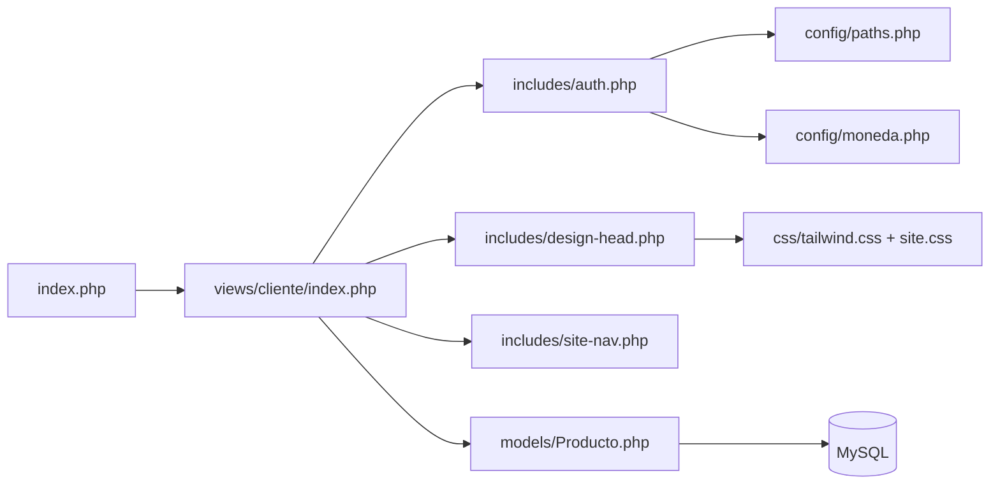
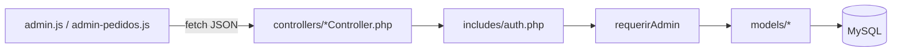
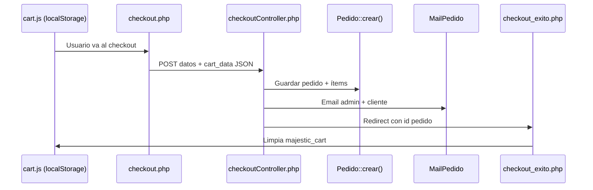

# DEPORTIVO

Tienda en línea de ropa deportiva (camisetas, pantalonetas y más). Proyecto PHP sin framework, con MySQL, panel de administración integrado y diseño **Kinetic Noir** (Tailwind + CSS propio).

---

## Tabla de contenidos

1. [Visión general](#visión-general)
2. [Requisitos](#requisitos)
3. [Instalación](#instalación)
4. [Estructura del proyecto](#estructura-del-proyecto)
5. [Cómo se conectan las piezas](#cómo-se-conectan-las-piezas)
6. [Área cliente](#área-cliente)
7. [Área administrador](#área-administrador)
8. [Modelos y base de datos](#modelos-y-base-de-datos)
9. [Configuración](#configuración)
10. [Diseño y estilos](#diseño-y-estilos)
11. [Pedidos y correo](#pedidos-y-correo)
12. [Desarrollo](#desarrollo)

---

## Visión general

| Capa | Tecnología |
|------|------------|
| Backend | PHP 8+ (PDO) |
| Base de datos | MySQL / MariaDB |
| Frontend | HTML, Tailwind CSS (build local), JavaScript vanilla |
| Sesiones | PHP `$_SESSION` |
| Correo | SMTP (Gmail) vía `SmtpMailer` |
| Assets | CSS/JS en `css/` y `js/`, imágenes en `uploads/` |

**Entrada del sitio:** `index.php` redirige a `views/cliente/index.php` (home de la tienda).

No hay router central: cada página es un archivo PHP y las APIs del admin responden JSON desde `views/administrador/controllers/`.

---

## Requisitos

- PHP 8.0+ con extensiones `pdo_mysql`, `openssl`, `mbstring`
- MySQL o MariaDB
- Node.js 18+ y npm (solo para compilar Tailwind)
- Servidor web (Laragon, Apache, Nginx, etc.)
- Cuenta Gmail con contraseña de aplicación (para notificaciones de pedidos)

---

## Instalación

### 1. Base de datos

1. Crea una base de datos llamada `deportivo`.
2. Importa el script completo:

   ```
   database/deportivo_phpmyadmin.sql
   ```

3. Si ya tenías la BD y solo falta el estado `cancelado` en pedidos:

   ```
   database/alter_pedidos_cancelado.sql
   ```

### 2. Conexión PHP

Edita `config/database.php`:

```php
$host = 'localhost';
$dbname = 'deportivo';
$user = 'root';
$password = 'tu_password';
```

### 3. Correo (pedidos)

Edita `config/mail.php` con tu Gmail y contraseña de aplicación:

```php
'smtp_user' => 'tu-correo@gmail.com',
'smtp_pass' => 'contraseña-de-aplicacion-sin-espacios',
'admin_email' => 'tu-correo@gmail.com',
```

### 4. CSS (Tailwind)

```bash
npm install
npm run build:css
```

### 5. Servidor

Apunta el document root a la carpeta del proyecto (ej. `http://deportivo.test` en Laragon).

**Usuario admin de prueba** (tras importar SQL): `admin@denim.com` (contraseña según tu BD).

---

## Estructura del proyecto

```
deportivo/
├── index.php                 # Redirige al home del cliente
├── config/                   # Configuración global
├── includes/                 # Lógica compartida (auth, mail, imágenes)
├── models/                   # Acceso a datos (Producto, Pedido, Categoria…)
├── middleware/               # Middleware legacy de sesión/admin
├── database/                 # Scripts SQL
├── css/                      # Estilos compilados y por página
├── js/theme/                 # Tema, tokens Tailwind, modo oscuro
├── data/                     # JSON de imágenes del sitio
├── uploads/                  # Imágenes subidas (productos, etc.)
├── views/
│   ├── cliente/              # Tienda pública
│   │   ├── index.php         # Home
│   │   ├── views/            # Páginas del cliente (catálogo, checkout…)
│   │   ├── includes/         # Nav, footer, cards, design-head
│   │   ├── controllers/      # Login, registro, checkout
│   │   └── js/               # Carrito, favoritos, filtros
│   └── administrador/        # Panel de gestión
│       ├── views/            # Pantallas admin (pedidos, categorías)
│       ├── includes/         # Barra admin, modales de producto/imagen
│       ├── controllers/      # APIs JSON (producto, pedido, categoría…)
│       ├── js/               # Lógica admin
│       └── css/              # Estilos solo del admin
├── tailwind.config.js        # Config Tailwind + tokens
├── package.json              # Build de CSS
└── postcss.config.js
```

---

## Cómo se conectan las piezas

### Flujo de una petición (página cliente)



1. **`includes/auth.php`** — Inicia sesión, calcula rutas (`$assetBase`, `$clienteViewsPath`, `$adminControllersPath`…) con `deportivo_init_paths()` y expone `$esAdmin`.
2. **`config/paths.php`** — Resuelve URLs relativas según desde qué carpeta se ejecuta el script (cliente, admin o raíz).
3. **Vistas** — Incluyen partials (`site-nav`, `site-footer`, `producto-card`) y, si el usuario es admin, el panel inline.

### Flujo de una API admin



Todas las APIs admin definen `DEPORTIVO_JSON_API`, cargan `auth.php`, llaman `requerirAdmin()` y devuelven `{ ok: true/false, ... }`.

### Flujo de compra



- **Carrito:** `localStorage` clave `majestic_cart` (no hay tabla de carrito en BD).
- **Pedido:** Tablas `pedidos` + `pedido_items`.
- **Notificación:** Gmail SMTP, no WhatsApp.

---

## Área cliente

### Páginas (`views/cliente/views/`)

| Archivo | Función |
|---------|---------|
| `catalogo.php` | Lista productos por categoría (`?categoria=slug`), filtros de talla/color |
| `producto.php` | Detalle, tallas, galería, añadir al carrito |
| `carrito_compras.php` | Bolsa de compras |
| `checkout.php` | Formulario de envío |
| `checkout_exito.php` | Confirmación tras comprar |
| `login.php` | Login y registro |
| `favoritos.php` | Lista de favoritos (`localStorage`) |
| `nosotros.php` | Página institucional |

### Controladores (`views/cliente/controllers/`)

| Archivo | Función |
|---------|---------|
| `loginController.php` | Autenticación |
| `registerController.php` | Registro de clientes |
| `logout.php` | Cerrar sesión |
| `checkoutController.php` | Procesa pedido, envía correos, redirige a éxito |

### JavaScript cliente (`views/cliente/js/`)

| Archivo | Función |
|---------|---------|
| `cart.js` | Carrito en `localStorage`, modal lateral, widget en nav |
| `checkout.js` | Resumen del carrito en checkout |
| `favorites.js` | Favoritos en `localStorage` |
| `catalogo-filters.js` | Filtros en catálogo sin recargar |
| `size-guide.js` | Modal guía de tallas |

### Includes importantes

| Archivo | Función |
|---------|---------|
| `design-head.php` | Carga fuentes, `tailwind.css`, `site.css` y CSS de página |
| `site-nav.php` | Navegación; oculta carrito/favoritos/búsqueda si `$esAdmin` |
| `producto-card.php` | Tarjeta reutilizable en catálogo y carrito |
| `sport-images.php` | Imágenes del sitio y helpers para modo admin inline |

---

## Área administrador

Hay **dos modos** de administración:

### 1. Edición inline (en páginas del cliente)

Si `$esAdmin === true`, se incluye `administrador/includes/admin-panel.php`, que carga:

- **admin-bar.php** — Barra superior con enlaces a Pedidos, Categorías y “Nuevo producto”
- **admin-modal.php** — CRUD de productos
- **admin-image-modal.php** — Cambiar imágenes del sitio o galería

El admin puede hacer clic en productos e imágenes en el catálogo/home para editarlos sin salir de la tienda.

### 2. Pantallas dedicadas (`views/administrador/views/`)

| Archivo | Función |
|---------|---------|
| `pedidos.php` | Listado, detalle, cambio de estado, correo al marcar “enviado” |
| `categorias.php` | Crear, editar y eliminar categorías |

### APIs (`views/administrador/controllers/`)

| Controlador | Acciones principales |
|-------------|----------------------|
| `productoController.php` | `get`, `create`, `update`, `delete`, `categorias`, imágenes |
| `sitioController.php` | Imágenes del home/catálogo (`data/site-images.json`) |
| `pedidoController.php` | `list`, `get`, `update_estado`, `count_pendientes` |
| `categoriaController.php` | `list`, `get`, `create`, `update`, `delete` |

### JavaScript admin (`views/administrador/js/`)

| Archivo | Conecta con |
|---------|-------------|
| `admin.js` | `productoController.php` |
| `admin-images.js` | `productoController.php`, `sitioController.php` |
| `admin-pedidos.js` | `pedidoController.php` |
| `admin-categorias.js` | `categoriaController.php` |

---

## Modelos y base de datos

### Modelos (`models/`)

| Clase | Responsabilidad |
|-------|-----------------|
| `Producto.php` | Catálogo, CRUD admin, tallas, imágenes, slugs |
| `Categoria.php` | CRUD categorías, conteo de productos |
| `Pedido.php` | Crear pedidos, listar, estados, enriquecer ítems con imagen |
| `SitioImagen.php` | Imágenes configurables del sitio |

### Tablas principales

| Tabla | Descripción |
|-------|-------------|
| `usuarios` | Clientes y admins (`rol`: `cliente` \| `admin`) |
| `categorias` | Categorías del catálogo (`slug` para URLs) |
| `productos` | Productos activos/inactivos, precio en COP |
| `producto_tallas` | Tallas por producto |
| `producto_imagenes` | Galería adicional |
| `pedidos` | Cabecera del pedido (cliente, envío, totales, `estado`) |
| `pedido_items` | Líneas del pedido (snapshot nombre/precio/talla) |

**Estados de pedido:** `pendiente`, `confirmado`, `enviado`, `cancelado`.

---

## Configuración

| Archivo | Qué configura |
|---------|----------------|
| `config/database.php` | Conexión PDO a MySQL |
| `config/paths.php` | Rutas web y helpers `deportivo_cliente_url()`, `deportivo_admin_url()` |
| `config/moneda.php` | COP, envío gratis desde $350.000, costo envío $15.000 |
| `config/mail.php` | SMTP Gmail para pedidos |
| `config/whatsapp.php` | Legacy (ya no se usa en checkout; pedidos van por email) |

### Autenticación (`includes/auth.php`)

- Inicia sesión PHP con cookie scoped al proyecto.
- Variables: `$usuarioLogueado`, `$esAdmin`, `$usuarioEmail`, rutas de assets.
- `requerirAdmin()` — Para APIs JSON; responde 403 si no es admin.

---

## Diseño y estilos

Sistema **Kinetic Noir**: documentado en `css/DESIGN.md`.

### Capas de CSS (orden de carga)

1. **`css/tailwind.css`** — Utilidades Tailwind compiladas (clases del markup).
2. **`css/site.css`** — Importa tokens, tema, componentes compartidos.
3. **`css/pages/*.css`** — Estilos específicos por página (index, catálogo, login…).
4. **`css/core/theme.css`** — Overrides de modo claro/oscuro sobre variables CSS.

### Tailwind (build local)

| Archivo | Rol |
|---------|-----|
| `js/theme/deportivo-tokens.cjs` | **Fuente única** de colores, tipografías y espaciados |
| `tailwind.config.js` | Escanea `views/`, `js/`, `css/` y aplica tokens |
| `css/tailwind-source.css` | `@tailwind base/components/utilities` |
| `css/tailwind.css` | **Salida compilada** (incluida en el repo) |

```bash
npm run build:css   # Compilar tras cambiar clases Tailwind
npm run watch:css   # Desarrollo con watch
```

### Modo oscuro

- `js/theme/init.js` — Lee `localStorage` y aplica clase `dark` en `<html>`.
- `js/theme/toggle.js` — Botón en la navegación.

---

## Pedidos y correo

### Al confirmar un pedido (`checkoutController.php`)

1. Valida formulario y carrito JSON.
2. `Pedido::crear()` — Transacción: inserta `pedidos` + `pedido_items`.
3. `MailPedido::notificarPedidoNuevo()` — Envía:
   - Correo al **admin** (`config/mail.php` → `admin_email`)
   - Correo de **confirmación al cliente**

### Al cambiar estado a “enviado” (admin)

- `pedidoController.php` → `MailPedido::enviarPedidoEnCamino()` — Avisa al cliente que el pedido va en camino.

### Clases de correo

| Archivo | Función |
|---------|---------|
| `includes/SmtpMailer.php` | Cliente SMTP (Gmail, STARTTLS) |
| `includes/MailPedido.php` | Plantillas HTML/texto de pedidos |

---

## Desarrollo

### Convenciones de rutas

- Desde **cliente/views**: `catalogo.php`, `../controllers/checkoutController.php`
- Desde **administrador/views**: `pedidos.php`, APIs vía `$adminControllersPath`
- Assets globales: `$assetBase` + `css/`, `js/`, `uploads/`

### Añadir una página cliente

1. Crear `views/cliente/views/mi-pagina.php`
2. Incluir `auth.php` y `design-head.php`
3. Reutilizar `site-nav.php` y `site-footer.php`
4. Si usas clases Tailwind nuevas → `npm run build:css`

### Añadir una pantalla admin

1. Crear `views/administrador/views/mi-seccion.php` (proteger con `$esAdmin`)
2. Opcional: `controllers/miController.php` + JS en `administrador/js/`
3. Enlazar desde `admin-bar.php`

### Subida de imágenes

- `includes/ImagenProducto.php` — Valida y guarda en `uploads/productos/`
- Usado por `productoController.php` y modales admin

### Datos que NO están en MySQL

| Dato | Dónde vive |
|------|------------|
| Carrito | `localStorage` → `majestic_cart` |
| Favoritos | `localStorage` |
| Imágenes del sitio (hero, banners) | `data/site-images.json` + `uploads/` |

---

## Resumen de conexiones

```
config/*  ──────────► includes/auth.php ──► todas las vistas
                         │
models/*  ◄────────────┼──────── controllers/* (cliente y admin)
                         │
database  ◄──────────────┘

views/cliente/views  ──► includes/*  ──► models/*
views/administrador/views  ──► administrador/controllers/*  ──► models/*

checkoutController  ──► Pedido + MailPedido  ──► config/mail.php
admin-pedidos.js    ──► pedidoController    ──► Pedido
admin.js            ──► productoController  ──► Producto
admin-categorias.js ──► categoriaController ──► Categoria + Producto (select)

design-head.php  ──► tailwind.css + site.css + pages/*.css
tailwind.config  ──► deportivo-tokens.cjs  ──► mismas clases que el markup PHP/JS
```

---

## Licencia y créditos

Proyecto privado DEPORTIVO — tienda deportiva multideporte.

Para dudas sobre el diseño visual, consulta `css/DESIGN.md`.
